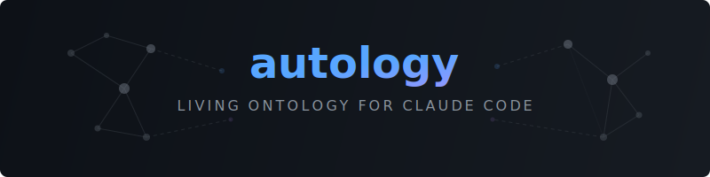

<p align="center">
  
</p>

## The Problem

AI tools have made individual developers dramatically more productive — but organizational knowledge is not keeping up.

As each developer moves faster with AI, decisions, conventions, and context become harder to share. Knowledge stays trapped in individual sessions. Teams repeat the same mistakes. New members onboard from docs that don't exist or are already stale.

## How It Works

```
      SessionStart hook
            │ injects autology-workflow skill as trigger guidance
            ↓
    Your Work: commit / decision
      ↑             │
   explore        triage
   (query)          │
      ↑    sync existing and capture new (parallel)
      │             │
      └───────── docs/*.md
```

**Storage**: Obsidian-compatible markdown in `docs/` — flat structure, YAML frontmatter, `[[wikilinks]]`

> **vs. automemory**: automemory is Claude's private, machine-local memory — per-developer, not committed to git, invisible to teammates. Autology is a team knowledge base: typed nodes, `[[wikilinks]]` forming a graph, doc-code sync, and git-committed so knowledge compounds across all developers.

## Skills

### `/autology:triage-knowledge` — Classify Knowledge Items

Scans `docs/` against the current action (commit, decision, refactor) and classifies each knowledge item as existing or new, with topology hints.

- **Existing items** → feeds `/autology:sync-knowledge` with matched nodes and connected neighbors
- **New items** → feeds `/autology:capture-knowledge` with suggested relations for wikilinks
- **Automatic**: triggered by `/autology:autology-workflow` after every significant action

```bash
/autology:triage-knowledge      # classify after an action
```

### `/autology:capture-knowledge` — Capture Knowledge

Extracts decisions, conventions, and context from conversation and writes them to `docs/*.md`.

- **Autonomous**: saves without being asked when knowledge is clearly worth capturing
- **Deduplicates**: Grep-checks before creating; updates existing nodes in place
- **Connects**: adds `[[wikilinks]]` to related nodes and updates the reverse links
- **Types**: `decision` · `component` · `convention` · `concept` · `pattern` · `issue` · `session`

```bash
/autology:capture-knowledge      # extract from current conversation
"remember this"        # triggers automatic capture
```

### `/autology:explore-knowledge` — Navigate the Knowledge Graph

Traverses the `[[wikilink]]` graph — operations that Grep alone cannot do.

| Mode | Command | Use Case |
|------|---------|----------|
| Graph overview | `/autology:explore-knowledge overview` | Hub nodes, orphans, connected components |
| Neighborhood | `/autology:explore-knowledge <node>` | 2-hop expansion — blast radius before refactoring |
| Path finding | `/autology:explore-knowledge path A B` | Shortest path between two concepts |

### `/autology:sync-knowledge` — Keep Docs in Sync

Detects and fixes doc-code drift in-place.

| Mode | Command | Use Case |
|------|---------|----------|
| Fast | `/autology:sync-knowledge` | Changed files only — run before every commit |
| Full | `/autology:sync-knowledge full` | Gaps, broken wikilinks, missing links — periodic audit |

### `/autology:autology-tutorial` — Interactive Tutorial

3-act hands-on walkthrough: triage + capture a decision → triage + sync on drift → query the knowledge graph with explore. Runs in a live git branch (~15 minutes).

```bash
/autology:autology-tutorial          # start from Act 1
/autology:autology-tutorial <1-3>    # jump to specific act
/autology:autology-tutorial reset    # clean up tutorial branch and docs
```

## Example

**Scenario**: a team implementing JWT authentication across multiple services.

**Without Autology**:
```
Dev A: implements JWT RS256 in 30 min → reasoning lives only in their session
Dev B: "Why JWT? Why RS256 over HS256?" → no answer in the codebase
Dev C: migrates internal service to HS256 → no record of why RS256 was chosen → rationale lost, change undocumented
New hire: reads stale ADRs that don't match the code
```

**With Autology**:
```
Dev A: implements JWT RS256
→ Claude captures automatically:
  [decision] JWT RS256 — Context (stateless API), Alternatives (sessions, OAuth),
             Consequences (token expiry UX, key rotation ops)
  [convention] Always verify JWT expiry before role check (links to → jwt-decision)

Dev B: new session — workflow skill injected at start, Claude knows to check docs/ for decisions
→ /autology:explore-knowledge path jwt-decision api-gateway
  → sees: jwt-decision → auth-middleware → api-gateway (2 hops)
→ implements the new service correctly, no re-research needed

Dev C: 3 months later, migrates an internal service to HS256 (simpler for internal-only traffic)
→ updates the code, forgets to update the doc
→ /autology:sync-knowledge (before committing)
  → finds: code now uses HS256 but docs/jwt-decision.md still says RS256
  → fixes the doc in-place

New hire: full decision chain available at session start, zero onboarding cost
```

## Prerequisites

- [Claude Code](https://claude.ai/code)
- [`jq`](https://jqlang.org) — used by the session-start hook for JSON encoding

## Installation

```bash
/plugin marketplace add Curt-Park/autology
/plugin install autology@autology
```

## Quick Start

```bash
# Learn the full loop (3-act interactive tutorial)
/autology:autology-tutorial

# Triage after an action (classify existing/new items)
/autology:triage-knowledge

# Capture new knowledge
/autology:capture-knowledge

# Explore the knowledge graph
/autology:explore-knowledge overview                # hubs, orphans, components
/autology:explore-knowledge <node>                  # neighborhood (2-hop expansion)
/autology:explore-knowledge path <node-a> <node-b>  # path between two concepts

# Sync docs with code
/autology:sync-knowledge       # fast — changed files only (run before commits)
/autology:sync-knowledge full  # full audit
```

## Development

```bash
git clone https://github.com/Curt-Park/autology.git
cd autology
claude --plugin-dir .
```

`/autology:autology-tutorial` is the end-to-end test: 3 acts covering triage + capture → triage + sync → explore. If all complete, the full loop works.

### Skill Evals

Each skill has `skills/{skill-name}/evals/evals.json` (behavioral) and `trigger_evals.json` (trigger accuracy, for description-invoked skills).

**Behavioral evals** run each case twice — with and without the skill — and grade assertions on process correctness (output format, routing rules, granularity decisions, wikilink integrity). Use `/eval-behavior <skill-name>` to run.

**Trigger evals** test whether the skill description causes Claude to invoke the skill on realistic prompts. Use `/eval-trigger <skill-name>` to run.

**Writing good assertions**: check process, not just output — e.g. "does sync cite the skip rule when triage returns no existing nodes?" not just "was a file created?". Aim for assertions that pass with the skill and fail without it.

**evals.json schema**:
```json
{
  "skill_name": "capture-knowledge",
  "evals": [{
    "id": 1, "name": "granularity-fold",
    "prompt": "User prompt verbatim",
    "assertions": [{ "id": "one-doc-created", "description": "Exactly 1 doc created (not 2)" }]
  }]
}
```

**trigger_evals.json schema**:
```json
[
  { "query": "prompt that should trigger", "should_trigger": true },
  { "query": "prompt that should not trigger", "should_trigger": false }
]
```

Aim for 6–10 cases each way, with emphasis on near-misses — queries that share keywords with the skill but belong to a different one.

## License

MIT
