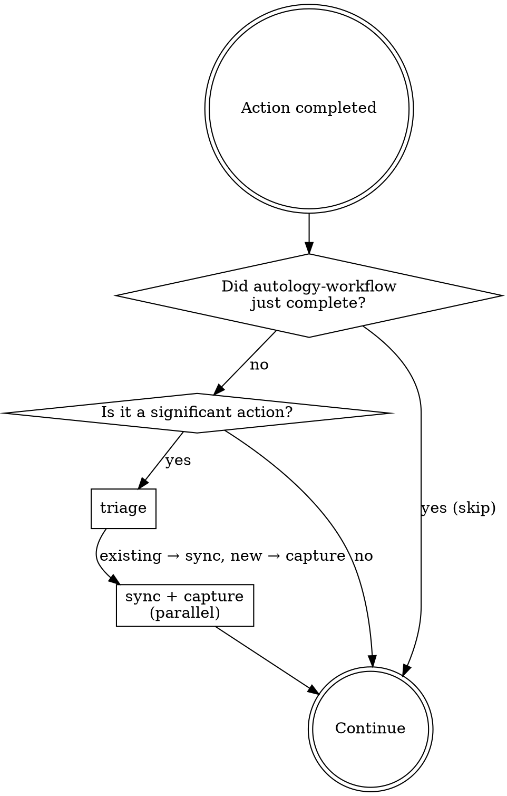

<EXTREMELY_IMPORTANT>
After every significant action, you ABSOLUTELY MUST run the autology workflow.

YOU DO NOT HAVE A CHOICE. YOU MUST INVOKE TRIAGE → SYNC/CAPTURE.

This is not negotiable. This is not optional. You cannot rationalize your way out of this.
</EXTREMELY_IMPORTANT>

## Overview

Route to the right autology skill after significant actions. `triage` runs context classification first — its output drives batch sync and batch capture.
**This skill is rigid. Follow exactly. Do not adapt.**

## Trigger Points

### [Action completed] After commit/push/PR or decision/convention discovered

1. `/autology:triage-knowledge` — context triage: analyze action, return classified list + topology hints
2. **In parallel** from the same triage result:
   - Existing items → batch `/autology:sync-knowledge` (use topology hints to verify connected nodes too)
   - New items → batch `/autology:capture-knowledge` (use suggested relations from hints to add wikilinks)

Signals for "action completed":
- commit, push, PR created
- "decided", "chose", "always", "never", "the rule is", any architectural choice

autology-workflow just completed (skip — do not re-trigger):
- triage-knowledge, sync-knowledge, or capture-knowledge just ran
- docs/*.md file was just written or edited

## The Rule

**After every significant action: triage → then sync + capture in parallel.**
Even a 1% chance applies means invoke it.

## Red Flags

These thoughts mean STOP — you're rationalizing:

| Thought | Reality |
|---------|---------|
| "This commit was too small" | No commit is too small to trigger the workflow. |
| "I just committed, no need to check docs" | Commit = trigger point. triage → sync or capture. |
| "This convention isn't worth capturing" | If it's a decision or convention, capture it. |
| "The docs are probably fine" | sync verifies. Don't assume. |
| "No docs/ in this repo" | Knowledge goes to the autology project docs/. |
| "I'll capture this later" | Later never comes. Do it now. |
| "There's nothing worth capturing" | You haven't run triage yet. How would you know? |
| "The user didn't ask me to" | The user configured this router. They already asked. |
| "I'm in the middle of something" | Run the workflow after each action. Not after everything. |
| "I just ran sync/capture" | That means autology-workflow just completed — check the completed action, not the current state. Skip. |

## Common Mistakes

| Mistake | Fix |
|---------|-----|
| sync/capture without triage first | Without triage + hints, risk duplicates or missing nodes |
| Ignore topology hints in sync/capture | Use connected/suggested relations to strengthen wikilinks |
| Only capture when user says "remember" | Self-discovered conventions are also capture targets |
