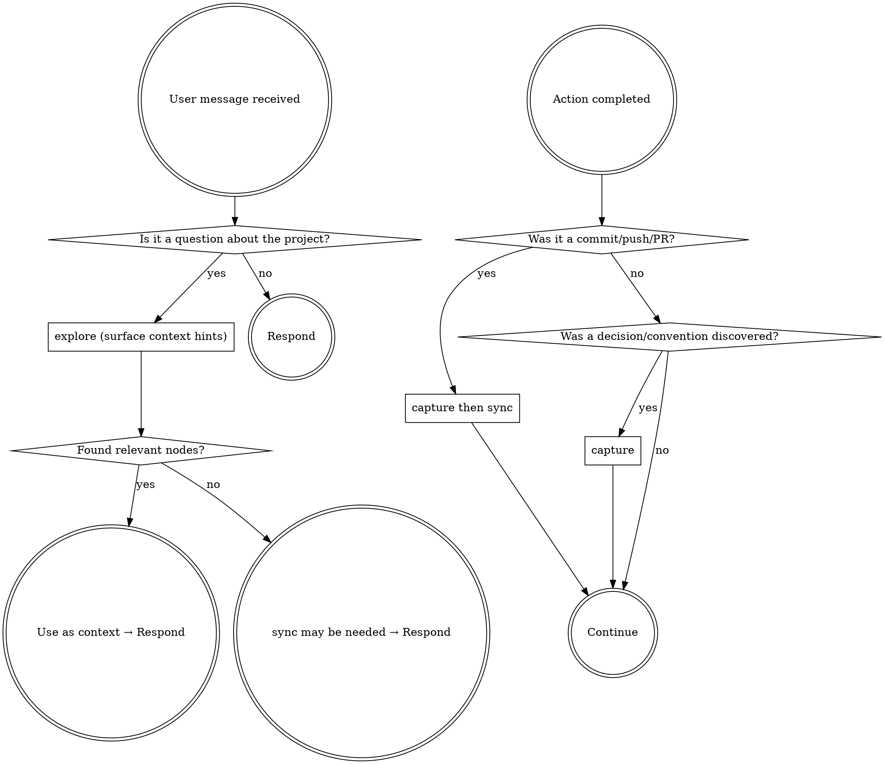

<IMPORTANT>
If there is even a 1% chance an autology skill applies, you MUST invoke it.
This is not optional. You cannot rationalize your way out of this.
</IMPORTANT>

## Overview

Route to the right autology skill at the right time. Two entry points:
- **User message** → check if explore applies before responding
- **Action completed** → check if capture and/or sync applies after acting

## Trigger Points

### [User message] User asks any question about the project

```
→ /autology:explore — BEFORE responding, to surface relevant context hints
```

Run explore to find docs/ nodes related to the question. Use the result as
context when formulating the answer — linked nodes, related decisions,
established conventions.

If explore finds no relevant nodes → the knowledge base may be incomplete.
Consider whether `/autology:sync` is needed to catch undocumented reality.

### [Action completed] After git commit / git push / PR creation

```
1. /autology:capture — were any decisions, conventions, or patterns
   discussed this session that aren't yet in docs/?
2. /autology:sync    — do docs/ nodes still match the codebase?
```

Run capture first, then sync. Both are required after every commit.

### [Action completed] After discovering a decision, convention, or pattern

```
→ /autology:capture — save it immediately, then report
```

Signals: "decided", "chose", "always", "never", "the rule is",
a new reusable approach, or any architectural choice.

## The Rule

**Two checks — one per entry point. Miss neither.**
Even a 1% chance applies means invoke it.



## Red Flags

These thoughts mean STOP — you're rationalizing:

| Thought | Reality |
|---------|---------|
| "I already know the answer, no need to explore" | explore may surface relevant decisions or conventions you'd miss. |
| "I just committed, no need to check docs" | Commit = trigger point. Run capture + sync. |
| "This convention isn't worth capturing" | If it's a decision or convention, capture it. |
| "The docs are probably fine" | sync verifies. Don't assume. |
| "No docs/ in this repo" | capture still applies — knowledge goes to the autology project docs/. |
| "I'll capture this later" | Capture NOW. Later never comes. |
| "This is just a small commit" | Size doesn't matter. Check the trigger points. |

## Common Mistakes

| Mistake | Fix |
|---------|-----|
| Skip skills after "quick" commits | Every commit is a trigger point |
| Only capture when user says "remember this" | Also capture self-discovered conventions |
| Run sync but skip capture | Always capture first, then sync |
