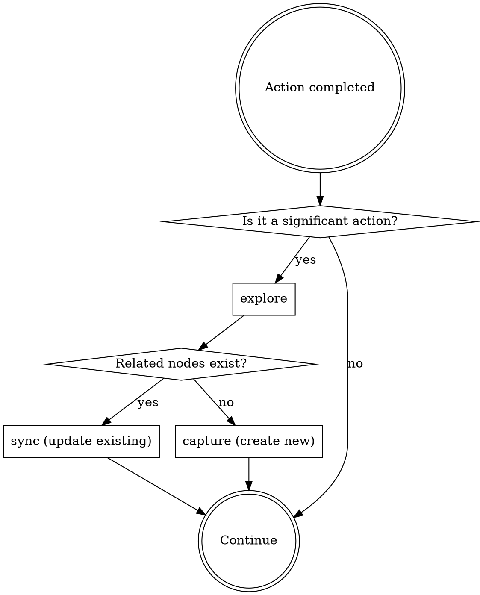

<IMPORTANT>
If there is even a 1% chance an autology skill applies, you MUST invoke it.
This is not optional. You cannot rationalize your way out of this.
</IMPORTANT>

## Overview

Route to the right autology skill after significant actions. `explore` is
used as a decision tool — not triggered by user messages.

## Trigger Points

### [Action completed] After commit/push/PR or decision/convention discovered

```
→ /autology:explore — check what already exists in docs/
```

Based on the result:
- Related nodes found → `/autology:sync` — update to reflect current reality
- No related nodes → `/autology:capture` — create a new node

Signals for "action completed":
- commit, push, PR created
- "decided", "chose", "always", "never", "the rule is", any architectural choice

### [Explicit invocation] User calls /autology:explore directly

Run explore as requested.

## The Rule

**After every significant action, explore first.**
Even a 1% chance applies means invoke it.



## Red Flags

These thoughts mean STOP — you're rationalizing:

| Thought | Reality |
|---------|---------|
| "I just committed, no need to check docs" | Commit = trigger point. explore → sync or capture. |
| "This convention isn't worth capturing" | If it's a decision or convention, capture it. |
| "The docs are probably fine" | sync verifies. Don't assume. |
| "No docs/ in this repo" | capture still applies — knowledge goes to the autology project docs/. |
| "I'll capture this later" | Capture NOW. Later never comes. |
| "This is just a small commit" | Size doesn't matter. Check the trigger points. |

## Common Mistakes

| Mistake | Fix |
|---------|-----|
| Skip explore after commit | explore first — it determines sync vs capture |
| Always capture without checking docs/ | If related node exists, sync instead |
| Always sync without checking docs/ | If no related node exists, capture instead |
| Only capture when user says "remember this" | Also capture self-discovered conventions |
