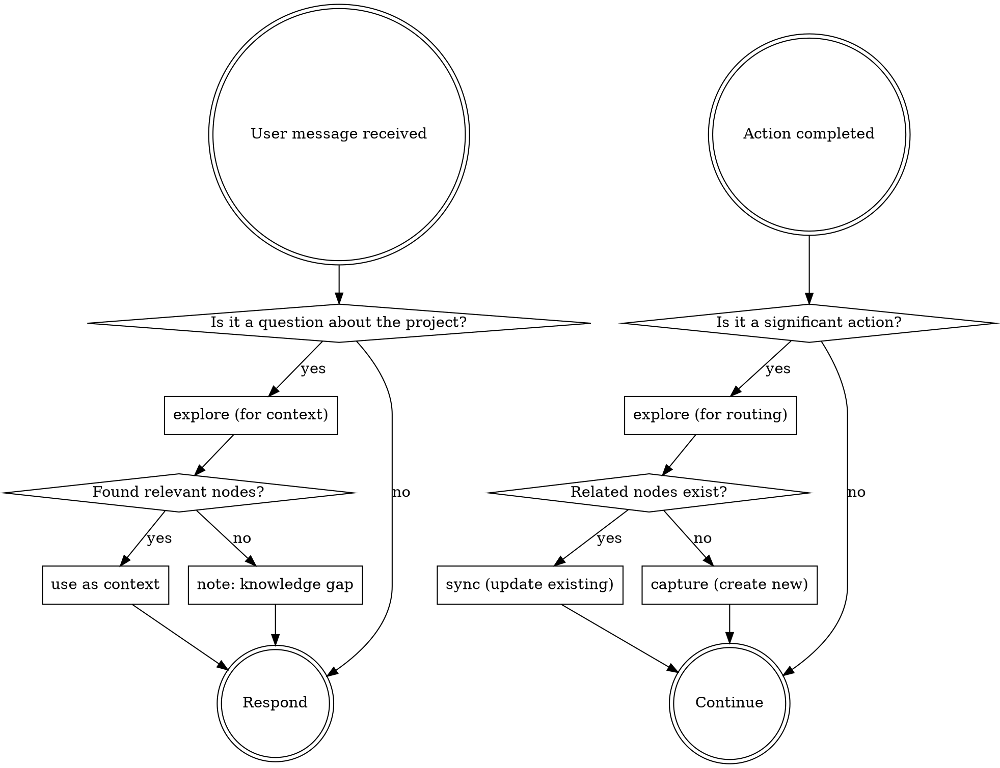

<IMPORTANT>
If there is even a 1% chance an autology skill applies, you MUST invoke it.
This is not optional. You cannot rationalize your way out of this.
</IMPORTANT>

## Overview

Route to the right autology skill at the right time. Two entry points:
- **User message** → explore before responding to surface relevant context
- **Action completed** → explore to determine whether to sync or capture

`explore` is the pivot in both flows: it tells you what already exists in
docs/ and guides the next step.

## Trigger Points

### [User message] User asks any question about the project

```
→ /autology:explore — BEFORE responding
```

Run explore to find docs/ nodes related to the question.
- Found relevant nodes → use as context when formulating the answer
- No relevant nodes found → knowledge base may be incomplete; note it

### [Action completed] After commit/push/PR or decision/convention discovered

```
→ /autology:explore — check what already exists in docs/
```

Then based on the result:
- Existing related nodes found → `/autology:sync` — update them to reflect current reality
- No related nodes found → `/autology:capture` — create a new node

Signals for "action completed":
- commit, push, PR created
- "decided", "chose", "always", "never", "the rule is", any architectural choice

## The Rule

**Two entry points. explore is always the first step.**
Even a 1% chance applies means invoke it.



## Red Flags

These thoughts mean STOP — you're rationalizing:

| Thought | Reality |
|---------|---------|
| "I already know the answer, no need to explore" | explore may surface relevant decisions or conventions you'd miss. |
| "I just committed, no need to check docs" | Commit = trigger point. Run capture + sync. |
| "This convention isn't worth capturing" | If it's a decision or convention, capture it. |
| "The docs are probably fine" | sync verifies. Don't assume. |
| "No docs/ in this repo" | capture still applies — knowledge goes to the autology project docs/. |
| "I'll capture this later" | Capture NOW. Later never comes. |
| "This is just a small commit" | Size doesn't matter. Check the trigger points. |

## Common Mistakes

| Mistake | Fix |
|---------|-----|
| Skip explore after commit | explore first — it determines sync vs capture |
| Always capture without checking docs/ | If related node exists, sync instead |
| Always sync without checking docs/ | If no related node exists, capture instead |
| Only capture when user says "remember this" | Also capture self-discovered conventions |
