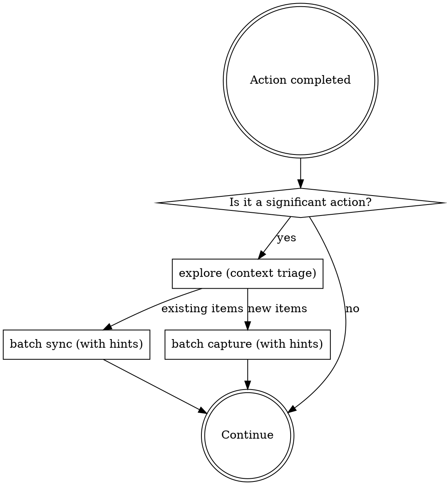

<IMPORTANT>
If there is even a 1% chance an autology skill applies, you MUST invoke it.
This is not optional. You cannot rationalize your way out of this.
</IMPORTANT>

## Overview

Route to the right autology skill after significant actions. `explore` runs context triage first — its classified output drives batch sync and batch capture.

## Trigger Points

### [Action completed] After commit/push/PR or decision/convention discovered

1. `/autology:explore` — context triage: analyze action, return classified list + topology hints
2. Existing items → batch `/autology:sync` (use topology hints to verify connected nodes too)
3. New items → batch `/autology:capture` (use suggested relations from hints to add wikilinks)

Both sync and capture can run from the same explore result.

Signals for "action completed":
- commit, push, PR created
- "decided", "chose", "always", "never", "the rule is", any architectural choice

## The Rule

**After every significant action: explore (triage) → batch sync + batch capture.**
Even a 1% chance applies means invoke it.

## Red Flags

These thoughts mean STOP — you're rationalizing:

| Thought | Reality |
|---------|---------|
| "I just committed, no need to check docs" | Commit = trigger point. explore → sync or capture. |
| "This convention isn't worth capturing" | If it's a decision or convention, capture it. |
| "The docs are probably fine" | sync verifies. Don't assume. |
| "No docs/ in this repo" | capture still applies — knowledge goes to the autology project docs/. |
| "I'll capture this later" | Capture NOW. Later never comes. |
| "This is just a small commit" | Size doesn't matter. Check the trigger points. |

## Common Mistakes

| Mistake | Fix |
|---------|-----|
| sync/capture without explore first | Without triage + hints, risk duplicates or missing nodes |
| Ignore topology hints in sync/capture | Use connected/suggested relations to strengthen wikilinks |
| Only capture when user says "remember" | Self-discovered conventions are also capture targets |
